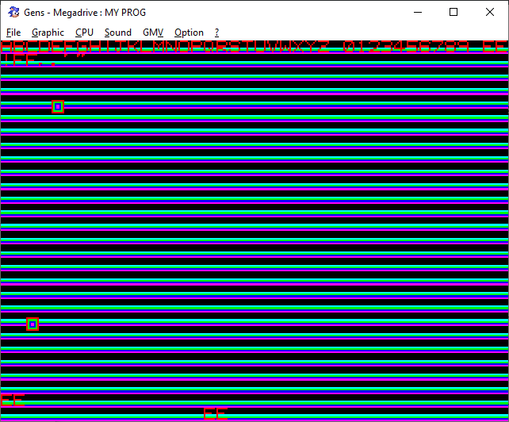

# **genesis-68k-demo**
#### Sega Genesis/Mega Drive 68k assembler demo

Requires asm68k to build. For Windows, a batch file is provided. Simply copy ```asm68k.exe``` into the project root and run ```BUILD.BAT```

This will create a ```Game.bin``` file that can be ran in any Mega Drive / Genesis emulator (or burned to an EPROM / flashcart and used with original hardware).



Demonstrates both scroll planes including tilemap fonts, animated hardware sprites, and sound via the Z80.

#### ROM file stucture
Every Genesis / Mega Drive binary must start with the 68k start-up vector table. Important vectors to initialise are the Stack pointer, Program counter, horizontal and vertical interrupt handlers. The remaining can be set to a generic/unimplemented handler for now.
```
  org   $00000000
  dc.l  $00FFFE00       ;0 Reset SP					$000000
  dc.l  START	        ;1 Reset PC					$000004
  dc.l	INTR		;2 Bus error					$000008
  dc.l	INTR		;3 Address error				$00000C
  dc.l	INTR		;4 Illegal instruction			 	$000010
  dc.l	INTR		;5 Division by zero			 	$000014
  dc.l	INTR		;6 CHK instruction			  	$000018
  dc.l	INTR		;7 TRAPV instruction				$00001C
  dc.l	INTR		;8 Privilege violation				$000020
  dc.l	INTR		;9 Trace					$000024
  dc.l	INTR		;10 						$000028
  dc.l	INTR		;11 						$00002C
  dc.l	INTR		;12 						$000030
  dc.l	INTR		;13 						$000034
  dc.l	INTR		;14 Reserved					$000038
  dc.l	INTR		;15 Uninitialised interrupt			$00003C
  dc.l	INTR		;16 Reserved					$000040
  dc.l	INTR		;17 Reserved					$000044
  dc.l	INTR		;18 Reserved					$000048
  dc.l	INTR		;19 Reserved					$00004C
  dc.l	INTR		;20 Reserved					$000050
  dc.l	INTR		;21 Reserved					$000054
  dc.l	INTR		;22 Reserved					$000058
  dc.l	INTR		;23 Reserved					$00005C
  dc.l	INTR		;24 Spurious interrupt 				$000060
  dc.l	INTR		;25 IRQ Level 1					$000064
  dc.l	INTR		;26 IRQ Level 2 EXT interrupt 			$000068
  dc.l	INTR		;27 IRQ Level 3					$00006C
  dc.l	HSYNC	        ;28 IRQ Level 4 Horizontal VDP interrupt	$000070
  dc.l	INTR		;29 IRQ Level 5					$000074
  dc.l	VSYNC	        ;30 IRQ Level 6 Vertical VDP interrupt		$000078
  dc.l	INTR		;31 IRQ Level 7					$00007C
  dc.l	INTR		;32 TRAP #00					$000080
  dc.l	INTR		;33 TRAP #01					$000084
  dc.l	INTR		;34 TRAP #02					$000088
  dc.l	INTR		;35 TRAP #03					$00008C
  dc.l	INTR		;36 TRAP #04					$000090
  dc.l	INTR		;37 TRAP #05					$000094
  dc.l	INTR		;38 TRAP #06					$000098
  dc.l	INTR		;39 TRAP #07					$00009C
  dc.l	INTR		;40 TRAP #08					$0000A0
  dc.l	INTR		;41 TRAP #09					$0000A4
  dc.l	INTR		;42 TRAP #10					$0000A8
  dc.l	INTR		;43 TRAP #11					$0000AC
  dc.l	INTR		;44 TRAP #12					$0000B0
  dc.l	INTR		;45 TRAP #13					$0000B4
  dc.l	INTR		;46 TRAP #14					$0000B8
  dc.l	INTR		;47 TRAP #15					$0000BC
  dc.l	INTR		;48 (FP) Branch or set on unordered condition   $0000C0
  dc.l	INTR		;49 (FP) Inexact result				$0000C4
  dc.l	INTR		;50 (FP) Divide by zero				$0000C8
  dc.l	INTR		;51 (FP) Underflow				$0000CC
  dc.l	INTR		;52 (FP) Operand error				$0000D0
  dc.l	INTR		;53 (FP) Overflow				$0000D4
  dc.l	INTR		;54 (FP) Signaling NAN				$0000D8
  dc.l	INTR		;55 (FP) Unimplimented data type		$0000DC
  dc.l	INTR		;56 MMU Configuration error			$0000E0
  dc.l	INTR		;57 MMU Illegal operation error			$0000E4
  dc.l	INTR		;58 MMU Access violation error			$0000E8
  dc.l  INTR		;59 Reserved					$0000EC
  dc.l  INTR		;60 Reserved					$0000F0
  dc.l  INTR		;61 Reserved					$0000F4
  dc.l  INTR		;62 Reserved					$0000F8
  dc.l  INTR		;63 Reserved					$0000FC
  ```

  Directly following is the ROM header:

```
  dc.b	"SEGA MEGA DRIVE "					;Console name (16)		$000100
  dc.b	"(C)SIFU 2021.JUL"					;Copyright information (16)	$000110
  dc.b	"MY PROG                                         "	;Domestic name (48)		$000120
  dc.b	"MY PROG                                         "	;Overseas name (48)		$000150
  dc.b	"GM 00000000-00"					;Serial number (14)		$000180
  dc.w	$0000							;Checksum (2)			$00018E
  dc.b	"JD              "					;I/O Support (16)		$000190
  dc.l	$00000000						;ROM start address (4)		$0001A0
  dc.l	$003FFFFF						;ROM end address (4)		$0001A4
  dc.l	$00FF0000						;Backup RAM start (4)		$0001A8
  dc.l	$00FFFFFF						;Backup RAM end (4)		$0001AC
  dc.b	"            "						;Backup RAM support (12)	$0001B0
  dc.b	"            "						;Modem support (12)		$0001BC
  dc.b	"                                        "		;Memo (40)			$0001C8
  dc.b	"JUE             "					;Country support (16)		$0001F0
```
The program code then begins at ```$000200.``` We define interrupt handlers, VDP register settings, tiles, and then create the main entry point using the label that we initialised the PC with. First thing our program must do is disable the TMSS, and then initialise the VDP:
```
START
	move.b	  ($A10001),d0		;TMSS
	andi.b	  #$0F,d0
	beq	  NOTMSS
	move.l	  #"SEGA",($A14000)
NOTMSS

	lea       VDPREG,a0
	move.w    (VDPCtrl),d0		;Read $C00004 = Status register
	move.l    #$00008000,d1
	moveq.l   #24-1,d2		;Loop counter for 24 registers
NextVDPSetting
	move.b    (a0)+,d1		;000080aa 	000081bb	000082cc
	move.w    d1,(VDPCtrl)		
	add.l     #$00000100,d1		;000081aa 	000082bb	000083cc
	dbra      d2,NextVDPSetting
```
Next we clear the VRAM, define palettes, and load tiles.   
